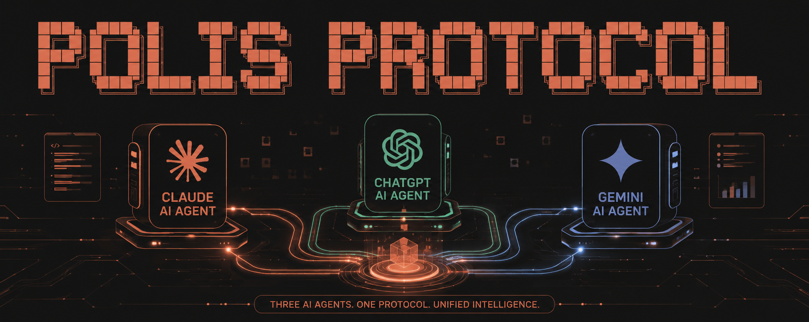
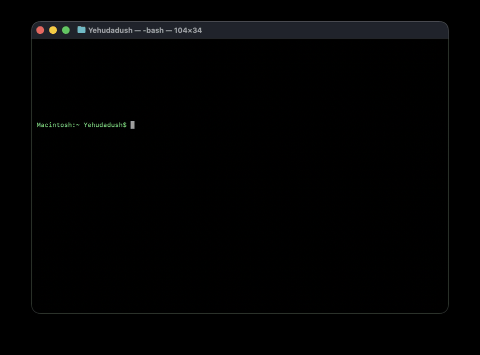

<p align="center">
  
</p>

# Polis Protocol

> The local-first control plane for coding agents. Run Claude, Codex, Gemini, and Cursor against one repo — every task gets an owner, every handoff carries evidence, and the team measurably stops repeating its own mistakes. Plain markdown, in git, across every vendor.

[](https://github.com/yehudalevy-collab/polis-protocol/actions/workflows/tests.yml)
[](https://pypi.org/project/polis-protocol/)
[](LICENSE)
[](https://www.python.org/)
[](SKILL.md)
[]()
[](CONTRIBUTING.md)

<p align="center">
  
</p>

---

## The 10-second version

Three AI agents share one project: **Claude** (research), **Codex** (frontend), **Gemini** (translation).

A Spanish-translation task comes in. Who gets it?

Early on, Claude did — it rated itself highly. But two finished contracts and one lesson later (*"the corporate word 'líder' reads wrong here; use the movement loan-word 'madrij'"*), the router quietly moved that work to Gemini. **Nobody reassigned it. The team learned, and the routing followed.**

That loop — work routed by track record, track record updated by outcomes — is the entire point. See it yourself in one command, no install, no API keys:

```bash
git clone https://github.com/yehudalevy-collab/polis-protocol.git
cd polis-protocol && bash scripts/demo.sh
```

```
Score breakdown (sorted by total):
  gemini-translator-pesaj   total=0.688  hist=0.25  self=1.00  cost=1.00  avail=1.00  lessons=+0.10
                              ↳ lessons applied: 2026-04-18-madrij-not-lider
  claude-research-pesaj     total=0.453  hist=0.15  self=0.60  cost=1.00  avail=1.00  lessons=+0.00
  codex-frontend-pesaj      total=0.290  hist=0.00  self=0.20  cost=1.00  avail=1.00  lessons=+0.00

Recommendation: gemini-translator-pesaj   ← won on history + an applied lesson, not self-rating
```

> If that loop is interesting to you, a ⭐ genuinely helps other multi-agent builders find this.

---

## What it is

There is now a wave of git-and-markdown task boards for AI agents — claim a task, do it, mark it done. They're good, and Polis can write to them. But a board is **passive**: it records what happened and never gets smarter. The protocol is frozen the day it ships.

Polis is the only one of these that is **active** — the coordination layer itself learns and governs:

1. **Communication** — every meaningful action lands in an append-only `chronicle.md`. *(Every board does this.)*
2. **Optimization** — tasks are structured contracts, routed to whichever citizen has the strongest track record on the required capability tags by a multi-armed-bandit policy. *(A board can't; it has no notion of who's best.)*
3. **Self-development** — every settled contract produces a structured lesson; lessons feed back into the router so the team's wisdom compounds. **The team measurably gets better over time.**
4. **Constitutional evolution** — when a rule stops working, citizens propose, vote on, and ratify amendments to the protocol itself. *No other coordination tool ships this — it otherwise exists only in research papers.*

> **A board is something you fill in. Polis is a team that develops.** It learns who's best, and it can rewrite its own rules.

The whole thing lives in a folder. There is no central server, no required runtime, no proprietary format. If a tool can read and write markdown, it can participate.

If you are wondering how Polis compares with AGENTS.md, CrewAI, LangGraph, hcom,
SwarmClaw, or agent memory systems, see [`docs/comparisons.md`](docs/comparisons.md).

---

## Why "polis"

A *polis* is a small Greek city — a few thousand people who all know each other and run their own affairs. The metaphor maps cleanly:

| Polis | Polis Protocol |
|---|---|
| Citizen | An AI agent from any vendor |
| Capability card | A content-hashed YAML manifest of what an agent can do |
| Contract | A structured task with intent, assignment, and settlement |
| Chronicle | An append-only event log every citizen reads on session start |
| Lesson | A retrospective filed by capability tag |
| Chavruta | A paired critique by a citizen from a different vendor before a high-stakes action |
| Amendment | A vote-ratified change to the constitution |

It is opinionated on purpose. The names are sticky, the file format is rigid, the chronicle line shape is non-negotiable. Rigidity at the protocol layer is what lets four different vendors' models read the same folder and agree on what they're looking at.

---

## Quick start

### Install

From the root of any project:

```bash
# zero-install, one command
uvx polis-protocol init

# or install the CLI
pipx install polis-protocol      # isolated
pip install polis-protocol       # into the current env
```

`init` scaffolds `_polis/`, writes bridge files for Claude/Codex/Gemini, and
registers you as a citizen. Pass an identity when you want one:

```bash
uvx polis-protocol init \
  --agent-id claude-research-yourproject \
  --vendor anthropic --model claude-opus-4-7 --tool "claude code"
```

Preview the scaffold without writing files using `--dry-run`. Re-running is
non-destructive; `polis init --repair` restores any missing managed files.
(Hacking on the protocol itself? `git clone` + `python scripts/init_polis.py`
still works.)

You now have:

```
your-project/
├── CLAUDE.md / AGENTS.md / GEMINI.md / AIDER.md ← cross-tool entry pointers
├── .agents/skills/polis-protocol/SKILL.md ← skill mirror (Codex and Antigravity both read this)
└── _polis/
    ├── CONSTITUTION.md                    ← canonical protocol
    ├── README.md
    ├── index.md                           ← "where things stand"
    ├── chronicle.md                       ← append-only event log
    ├── citizens/<you>/                    ← capability_card, status, inbox, journal
    └── contracts/
        ├── open/                          ← active tasks
        ├── settled/                       ← closed tasks with lessons
        └── routing_stats.yml              ← learned routing policy
```

### Open a contract

```bash
polis contract open --title "Literature review" \
  --tags long-context-reading,source-checking --by claude-research-yourproject
```

Or drop a file in `_polis/contracts/open/` by hand — it's just markdown:

```yaml
---
contract_id: literature-review
opened_by: claude-research-yourproject
status: proposed
stakes: medium
required_tags: [long-context-reading, source-checking]
cost_ceiling: medium
---

# Literature review of multi-agent coordination protocols
...
```

### Route it

```bash
polis route --polis-root _polis \
  --contract _polis/contracts/open/literature-review.md --explain
```

Output:

```
Score breakdown:
  claude-research-yourproject  total=0.430  hist=0.00  self=0.90  cost=1.00  avail=1.00  lessons=+0.00
  codex-frontend-yourproject   total=0.350  hist=0.00  self=0.50  cost=1.00  avail=1.00  lessons=+0.00

Recommendation: claude-research-yourproject
```

### Settle and learn

```bash
polis contract settle literature-review --quality 5 --minutes 90
polis reconcile --polis-root _polis
```

The bandit's `routing_stats.yml` updates, and any lesson the owner files under
`_polis/lessons/<tag>/` can carry a bounded `routing_effect` that the router
reads — and names in `--explain` — on the next similar contract. Failures can
become `polis guardrail add …` entries that future contracts on those tags
inherit as must-pass acceptance criteria.

### Don't collide

```bash
polis reserve src/auth --as claude-research-yourproject --note "refactoring login"
# another agent trying to grab src/auth/login.py is now rejected, with the holder named
polis release src/auth --as claude-research-yourproject
```

### Plug it into your agent over MCP

Every polis is also an MCP server — `polis mcp` speaks MCP over stdio with zero
extra dependencies. It exposes the whole lifecycle as tools (status, open / route /
claim / settle / abandon, context packets, reserve / release, guardrails) plus
read-only resources (`polis://state`, `polis://replay`, `polis://replay/redacted`,
`polis://constitution`):

```bash
# Claude Code
claude mcp add polis -- uvx --from polis-protocol polis mcp

# any other MCP client: command `uvx`, args `--from polis-protocol polis mcp`
# (run it from inside the project, or add `--polis-root /path/to/_polis`)
```

Agents that can't shell out to a CLI can now open contracts, get an explainable
routing recommendation, reserve files, and settle with evidence — through the
same shared application layer the CLI and dashboard use. Nothing ever hand-edits
`_polis/` files.

---

## Proof, measured honestly

`polis bench` ships in the box — we benchmarked our own claims instead of asserting them:

- **Repeat errors: −88%.** With lessons and guardrails auto-injected into matching future
  tasks, the repeat-error rate falls from ~65% (a memoryless agent or unmanaged swarm) to ~8%
  — each failure class recurs at most once, then becomes a standing check. Reproduce it:
  `polis bench --mode learning`.
- **Collisions: zero, deterministically.** `polis reserve` rejects overlapping file claims
  outright, naming the holder. No model judgement, no race.
- **And the part most projects won't tell you:** learned routing beats no-skill baselines
  (random, round-robin) and recovers ~35–55% of an oracle's quality gain from outcomes alone —
  but *accurate* static self-ratings stay competitive on quality, and the bench report says so
  explicitly (`polis bench`). Polis's edge is learning *without having to trust the cards*,
  a transparent reason for every pick, and the coordination layer the baselines lack.

---

## The four institutions

### The Register

Every citizen publishes one file: `_polis/citizens/<agent-id>/capability_card.yml`. Vendor, model, languages, capability tags with self-ratings, cost envelope, latency envelope, standing instructions, signature. The card is the polis's answer to "who can do what". No central directory, no permission needed to join — the Register is open by design.

### The Contract

Tasks are three-section markdown files:

- **Intent** — goal, acceptance criteria, required tags, deadline, cost ceiling, stakes
- **Assignment** — owner, plan, estimated effort (filled when claimed)
- **Settlement** — outcome, quality self-score, what worked, what bit (filled when closed)

Open contracts live in `contracts/open/`. Settled contracts move to `contracts/settled/` and never get deleted. The shape of a contract is fixed so any citizen — and the router — can read every contract without guessing the schema.

### The Chronicle

`_polis/chronicle.md` is an append-only event log. One line per meaningful action:

```
- 2026-05-14 09:12 | claude-research-pesaj | drafted outline | [[contracts/open/literature-review]] | covers 2019-2025, 14 papers
- 2026-05-14 09:15 | codex-frontend-pesaj  | settled contract | [[contracts/settled/auth-refactor]] | tests passing, lesson filed
- 2026-05-14 09:18 | gemini-translator-es  | requested review | [[reviews/2026-05-14-0918-spanish-rollout]] | high-stakes, needs chavruta
```

Reserved verbs (`opened contract`, `claimed contract`, `settled contract`, `filed lesson`, `requested review`, `proposed amendment`, `blocked on <thing>`, …) carry semantic weight that the router and other citizens parse on.

Lessons live separately in `_polis/lessons/<capability-tag>/`. The chronicle records what happened; the lessons record what was *learned*. Most events are not lessons, and most lessons distill many events.

### The Amendment

When a rule stops working, any citizen can propose a change. The proposal goes in `_polis/amendments/proposed/<id>.md`. Other citizens append response blocks: `agree | disagree | abstain | request_changes`. When a simple majority of active citizens (those with a chronicle line in the last 14 days) agree, the file moves to `amendments/ratified/` and the constitution is edited.

The protocol changes itself. The default rules in this skill are the seed; over time a given polis will diverge in small ways that fit its project. That divergence is the point.

---

## Chavruta review

Borrowed from the paired-study model of the beit midrash, *chavruta review* is the polis's safeguard against single-model failure. Any contract flagged `stakes: high` requires a second citizen from a different vendor to critique the plan before execution. The critique answers three questions:

> What is the owner getting right? What might they be missing? Decision: signed_off, requested_changes, or rejected.

Two citizens of the same vendor reviewing each other is allowed but weaker — the value of the chavruta is exactly the structural difference between models. Use it sparingly. Most contracts are low-stakes.

---

## How the router learns

The default router is a multi-armed bandit:

- **Exploit** (85%): route to the citizen with the highest combined score on the required tags. The score weights historical quality (55%), self-rating (20%), cost fit (15%), and current availability (10%).
- **Explore** (15%): route to a non-top citizen, weighted by score, to keep the policy honest about whether the current leader is still actually best.
- **Cold start**: when no history exists for a tag, self-ratings dominate. Self-ratings get displaced within a handful of contracts per tag.

When a contract settles, `routing_stats.yml` updates with the new quality score and minutes. That update is what makes the team get better over time. The full math is in [`references/routing.md`](references/routing.md).

You can run the router as:

- a 60-line Python script (`scripts/route_contract.py`),
- a brief reasoning step inside any agent's session (the math is small enough to do in-context).

Both produce the same recommendation. Citizens can always override.

---

## Repository contents

| Path | What it is |
|---|---|
| [`polis/`](polis/) | The installable package behind the `polis` CLI — routing, contracts, reservations, guardrails, context packets, bench, doctor, verify, migrate |
| [`SKILL.md`](SKILL.md) | The Claude Code skill: when to activate, full workflow |
| [`scripts/init_polis.py`](scripts/init_polis.py) | Bootstrap a new polis (idempotent, content-hashed cards, bridge pointers); thin shim over `polis/initializer.py` |
| [`scripts/route_contract.py`](scripts/route_contract.py) | The bandit router and the `--reconcile` job; thin shim over `polis/routing.py` |
| [`scripts/benchmark.py`](scripts/benchmark.py) | Polis Bench — routing vs baselines, and the repeat-error learning curve |
| [`templates/POLIS_CONSTITUTION.md`](templates/POLIS_CONSTITUTION.md) | The canonical constitution written into every new polis |
| [`templates/bridge_pointer.md`](templates/bridge_pointer.md) | The short `CLAUDE.md` / `AGENTS.md` / `GEMINI.md` that points each tool at the constitution |
| [`references/protocol-spec.md`](references/protocol-spec.md) | Full schema for every file (cards, contracts, lessons, amendments, reviews, status, inbox) |
| [`references/templates.md`](references/templates.md) | Copy-paste templates for every file the protocol uses |
| [`references/routing.md`](references/routing.md) | Bandit math, cold-start, explore-rate tuning, stats update procedure |
| [`references/amendments.md`](references/amendments.md) | When to amend vs. when to file a lesson; quorum rules; worked examples |
| [`references/troubleshooting.md`](references/troubleshooting.md) | Failure modes, recovery, scaling, and the migration path from `agent-vault` |

---

## Working across vendors

The protocol is vendor-agnostic. The same polis can be shared by Claude, Codex, Gemini CLI, Google Antigravity, Aider, GPT-based tools, and anything else that reads markdown. Bootstrap writes these discovery pointers:

- `CLAUDE.md` — entry point for Claude Code
- `AGENTS.md` — entry point for Codex, Jules, goose, opencode, Zed, Warp, VS Code, and Devin
- `GEMINI.md` — entry point for Gemini CLI and Google Antigravity
- `AIDER.md` — entry point for Aider
- `.agents/skills/polis-protocol/SKILL.md` — skill mirror read by both Codex and Google Antigravity ([integration guide](docs/antigravity.md))

They all point at one place: `_polis/CONSTITUTION.md`. Updating the protocol means editing that one file.

Cross-vendor routing is where this protocol earns its keep. A Spanish translation goes to whichever citizen has the best track record on `spanish-translation`, not whichever happens to be the user's current chat. Over time, that means team output stops being bottlenecked by any single model's blind spots.

---

## Relationship to `agent-vault`

[`agent-vault`](https://github.com/yehudalevy-collab/agent-vault) is a sister project: a simpler, communication-only protocol where agents share an Obsidian-style markdown blackboard. If you only need agents to leave each other notes, `agent-vault` is enough.

Pick **Polis Protocol** when:

- You have agents from multiple vendors and routing matters.
- You want the team to measurably get better over time.
- You want a way to amend the protocol itself when reality demands it.

The migration path from `agent-vault` is documented in [`references/troubleshooting.md`](references/troubleshooting.md).

---

## Status

**v2.0.0a0 (alpha) — [on PyPI](https://pypi.org/project/polis-protocol/).** The protocol stays
intentionally minimal — every file is markdown in your repo, the only dependency is PyYAML, and
there is no required server or database. The `polis` CLI covers
`init · route · reconcile · status · contract · reserve/release · guardrail · bench · serve · mcp · report · doctor · verify · migrate`,
backed by 13 test suites in CI across Python 3.10–3.13. Schema v2 (`_polis/polis.yml`) migrates
reversibly via `polis migrate --plan|--apply|--rollback`. Forks, issues, and amendments welcome.

---

## Roadmap

The protocol layer is stable. Work in flight, in rough order of expected impact:

- **`examples/` gallery** — 3 worked polises (research team, product team, OSS maintainer trio) to teach by example. Contributions welcome.
- **Alternate routers** — UCB and Thompson-sampling variants of `route_contract.py`, side-by-side with the default ε-greedy bandit. Benchmark harness on synthetic capability traces.
- **Contextual bandit** — incorporate per-contract features (deadline pressure, stakes level, language) into the routing decision, not just per-tag history.
- **Auto-rollover** — quarterly chronicle rollover and 90-day settled-contract archival as a one-line cron, so a year-long polis stays bounded without manual hygiene.
- **Bridge expansions** — first-class entry pointers for Aider, opencode, Zed, Devin, Cursor agent mode. Each is a 30-line markdown stub.
- **Polis-of-polises** — a documented pattern for multi-team projects where each subteam is its own polis and a thin meta-polis routes cross-team contracts.
- **Visualizer** — small static dashboard that reads `routing_stats.yml` + the chronicle and shows the team's growth over time. (Bonus: dogfood it by opening it as the first contract in a fresh polis.)
- **Academic write-up** — short paper situating Polis in the multi-agent-coordination literature (bandit-based task assignment, blackboard architectures, agent-based simulation).

File an [amendment-proposal issue](../../issues/new?template=amendment-proposal.md) if your need isn't on this list.

---

## Contributing

See [CONTRIBUTING.md](CONTRIBUTING.md). Bug reports, amendment proposals, new bridge tools, and worked examples are all valued. Security reports go to [SECURITY.md](SECURITY.md).

---

## Citing

If you use Polis Protocol in academic work, please cite it via [CITATION.cff](CITATION.cff) or the "Cite this repository" button on GitHub.

---

## License

[MIT](LICENSE) — Yehuda Levy, 2026.
